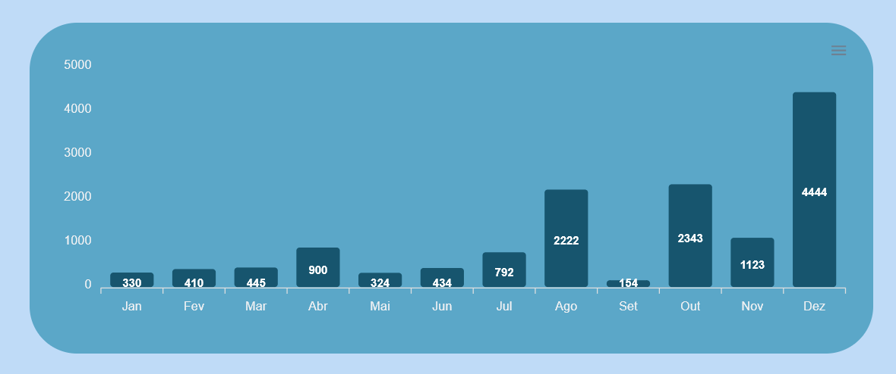
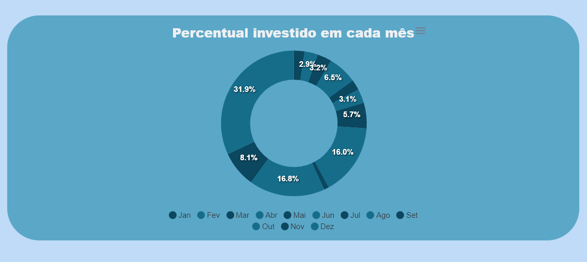
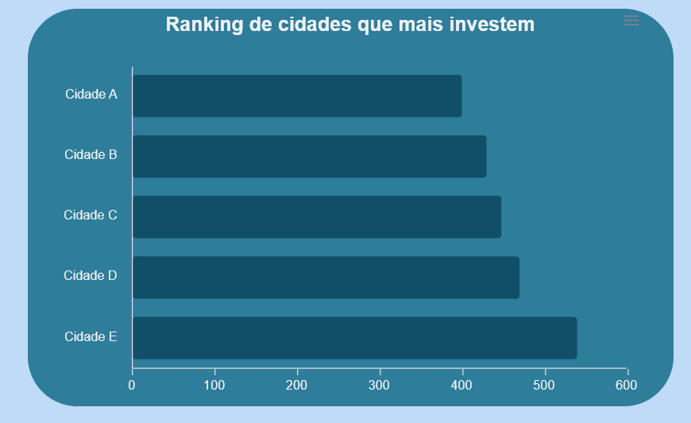

# Implementação de Gráficos em React

Sendo a peça chave para mostrar os dados orçamentários para o usuário, os gráficos são uma parte importante do projeto. Para isso, foi utilizado a biblioteca [ApexCharts](https://apexcharts.com), que é uma biblioteca opensource para visualização de dados em formato gráfico (dashboards) em React.

## Instalação

Para instalar a biblioteca, basta executar a seguinte linha de comando dentro da pasta raiz do projeto:

```bash	
npm install --save apexcharts react-apexcharts
```

Para importar a biblioteca, basta adicionar a seguinte linha de código no componente que deseja utilizar os gráficos:

```javascript
import ReactApexChart from 'react-apexcharts'
```

## Utilização da biblioteca no projeto

A ideia definida pelo time de desenvolvimento é que a página web do projeto tenha 3 gráficos, o primeiro, que é o gráfico de barras, mostra a distribuição dos gastos na área da saúde ao longo dos meses de um determinado município, o segundo, que é o gráfico de rosquinha, mostra a porcentagem desses gastos ao longo dos meses, e o terceiro, que é um gráfico de barras deitado, mostra o ranking de municípios que mais investem na saúde do estado do Goiás.

Tanto o gráfico de barras como o gráfico de rosquinha possuem um filtro de ano e município unificado, que permite ao usuário escolher o ano e o município que deseja visualizar os dados. Além disso, a biblioteca ApexCharts permite que o usuário baixe os gráficos em formato SVG, PNG e CSV.

### Gráfico de barras

O primeiro gráfico, o gráfico de barras, é implementado na aba "Pesquisa" da página web. Para isso, foi criado um componente chamado "GraficoBarra", onde é definido o gráfico de barras e suas propriedades. gráfico. Segue o código do componente:

```javascript
import React from 'react';
import Chart from 'react-apexcharts';

function GraficoBarra() {
    const options = {
        chart: {
            toolbar: {
                show: true, // esconde a barra de ferramentas
            },
        },
        plotOptions: {
            bar: {
                horizontal: false, // faz o gráfico de barras ser vertical
                borderRadius: 3, // define o raio das bordas das barras
            },
        },
        grid: {
            show: false,
        },
        colors: ['#0B475E'], // define as cores das barras
        xaxis: {
            categories: ['Jan', 'Fev', 'Mar', 'Abr', 'Mai', 'Jun', 'Jul', 'Ago', 'Set', 'Out', 'Nov', 'Dez'], // define as categorias do eixo X
            labels: {
                style: {
                    colors: '#EEF0F2', // define a cor do texto do eixo X
                    fontSize: '13px',
                },
            },
        },
        yaxis: {
            labels: {
                style: {
                    colors: '#EEF0F2', // define a cor do texto do eixo X
                    fontSize: '13px',
                },
            },
        },
    };

    const series = [
        {
            name: 'Valor investido (R$)',
            data: [330, 410, 445, 900, 324, 434, 792, 2222, 154, 2343, 1123, 4444], // dados da série
        },
    ];

    return <Chart options={options} series={series} type="bar" height={300} width={850} />;
}

export default GraficoBarra;
```
Note que, o trecho abaixo é responsável por definir as propriedades do gráfico de barras e estilização do gráfico:

```javascript
    const options = {
        chart: {
            toolbar: {
                show: true, // esconde a barra de ferramentas
            },
        },
        plotOptions: {
            bar: {
                horizontal: false, // faz o gráfico de barras ser vertical
                borderRadius: 3, // define o raio das bordas das barras
            },
        },
        grid: {
            show: false,
        },
        colors: ['#0B475E'], // define as cores das barras
        xaxis: {
            categories: ['Jan', 'Fev', 'Mar', 'Abr', 'Mai', 'Jun', 'Jul', 'Ago', 'Set', 'Out', 'Nov', 'Dez'], // define as categorias do eixo X
            labels: {
                style: {
                    colors: '#EEF0F2', // define a cor do texto do eixo X
                    fontSize: '13px',
                },
            },
        },
        yaxis: {
            labels: {
                style: {
                    colors: '#EEF0F2', // define a cor do texto do eixo X
                    fontSize: '13px',
                },
            },
        },
    };
```

Já o trecho abaixo é responsável por definir os dados que serão inseridos no gráfico:

```javascript
    const series = [
        {
            name: 'Valor investido (R$)',
            data: [330, 410, 445, 900, 324, 434, 792, 2222, 154, 2343, 1123, 4444], // dados da série
        },
    ];
```

O componenente "GraficoBarra" é importado no componente "Pesquisa", onde é renderizado na tela. Segue o trecho do código da "Pesquisa" contendo a importação e implementação do gráfico, respectivamente:

```javascript
import GraficoBarra from './Graficos/GraficoBarra';
```
```javascript
<div className="grafico1-pesquisa">
    <GraficoBarra />
</div>
```

Por fim, o gráfico aparece página do projeto da seguinte forma:



## Grafico de rosquinha

O segundo gráfico, o gráfico de rosquinha, também é implementado na aba "Pesquisa" da página web. Para isso, foi criado um componente chamado "GraficoRosquinha", onde é definido o gráfico de rosquinha e suas propriedades. Segue o código do componente:

```javascript
import React from 'react';
import Chart from 'react-apexcharts';

function GraficoRosquinha() {
  const options = {
    chart: {
      toolbar: {
        show: true, // mostra a barra de ferramentas
      },
    },
    title: {
      text: 'Percentual investido em cada mês', // define o título do gráfico
      align: 'center', // centraliza o título
      style: {
        fontSize: '20px', // define o tamanho da fonte
        color: '#EEF0F2', // define a cor do título
      },
    },
    labels: ['Jan', 'Fev', 'Mar', 'Abr', 'Mai', 'Jun', 'Jul', 'Ago', 'Set', 'Out', 'Nov', 'Dez'],
    plotOptions: {
      pie: {
        donut: {
          size: '60%', // define o tamanho do buraco no meio do gráfico
        },
      },
    },
    stroke: {
      show: false, // remove a borda do gráfico
    },
    colors: ['#0B475E', '#156D8A'], // define as cores das fatias
    legend: {
      position: 'bottom', // define a posição da legenda
    },
  };

  const series = [330, 410, 445, 900, 324, 434, 792, 2222, 154, 2343, 1123, 4444]; // seus dados de série

  return <Chart options={options} series={series} type="donut" width={430} />;
}

export default GraficoRosquinha;
```
O trecho abaixo é responsável as propriedades e estilização do gráfico:

```javascript
  const options = {
    chart: {
      toolbar: {
        show: true, // mostra a barra de ferramentas
      },
    },
    title: {
      text: 'Percentual investido em cada mês', // define o título do gráfico
      align: 'center', // centraliza o título
      style: {
        fontSize: '20px', // define o tamanho da fonte
        color: '#EEF0F2', // define a cor do título
      },
    },
    labels: ['Jan', 'Fev', 'Mar', 'Abr', 'Mai', 'Jun', 'Jul', 'Ago', 'Set', 'Out', 'Nov', 'Dez'],
    plotOptions: {
      pie: {
        donut: {
          size: '60%', // define o tamanho do buraco no meio do gráfico
        },
      },
    },
    stroke: {
      show: false, // remove a borda do gráfico
    },
    colors: ['#0B475E', '#156D8A'], // define as cores das fatias
    legend: {
      position: 'bottom', // define a posição da legenda
    },
  };
```

Já o trecho abaixo é reponsável por mostrar os dados que serão inseridos no gráfico:

```javascript
const series = [330, 410, 445, 900, 324, 434, 792, 2222, 154, 2343, 1123, 4444]; // seus dados de série
```

Como mostrado no gráfico de barras, a importação e implementação do componente "GraficoRosquinha" no componente "Pesquisa" é semelhante:
    
```javascript
import GraficoRosquinha from './Graficos/GraficoRosquinha';
```
```javascript
<div className="grafico2-pesquisa">
    <GraficoRosquinha />
</div>
```

O gráfico de rosquinha aparece na página web da seguinte forma:


### Gráfico de barras deitado

O terceiro gráfico, o gráfico de barras deitado, é implementado na aba "Home" da página web. Para isso, foi criado um componente chamado "GraficoBarraRanking", onde é definido o gráfico de barras deitado e suas propriedades. Segue o código do componente:

```javascript
import React from 'react';
import Chart from 'react-apexcharts';

function GraficoBarraRanking() {
    const options = {
        chart: {
            type: 'bar',
        },
        title: {
            text: 'Ranking de cidades que mais investem', // define o título do gráfico
            align: 'center', // centraliza o título
            style: {
                fontSize: '20px', // define o tamanho da fonte
                color: '#EEF0F2', // define a cor do título
                fontWeight: 'bold',
              },
        },
        plotOptions: {
            bar: {
                horizontal: true, // torna o gráfico de barras horizontal
                borderRadius: 3, // define o raio das bordas das barras
            },
        },
        dataLabels: {
            enabled: false,
        },
        grid: {
            show: false,
        },
        colors: ['#0B475E'], // define as cores das barras
        xaxis: {
            categories: ['Cidade A', 'Cidade B', 'Cidade C', 'Cidade D', 'Cidade E'], // suas cidades
            labels: {
                style: {
                    colors: '#EEF0F2', // define a cor do texto do eixo X
                    fontSize: '13px',
                },
            },
        },
        yaxis: {
            labels: {
                style: {
                    colors: '#EEF0F2', // define a cor do texto do eixo X
                    fontSize: '13px',
                },
            },
        }
    };

    const series = [
        {
            data: [400, 430, 448, 470, 540], // seus dados de classificação
        },
    ];

    return <Chart options={options} series={series} type="bar" height={400} width={600} />;
}

export default GraficoBarraRanking;
```

O trecho abaixo é responsável por definir as opções do gráfico e suas estilizações:
```javascript
    const options = {
        chart: {
            type: 'bar',
        },
        title: {
            text: 'Ranking de cidades que mais investem', // define o título do gráfico
            align: 'center', // centraliza o título
            style: {
                fontSize: '20px', // define o tamanho da fonte
                color: '#EEF0F2', // define a cor do título
                fontWeight: 'bold',
              },
        },
        plotOptions: {
            bar: {
                horizontal: true, // torna o gráfico de barras horizontal
                borderRadius: 3, // define o raio das bordas das barras
            },
        },
        dataLabels: {
            enabled: false,
        },
        grid: {
            show: false,
        },
        colors: ['#0B475E'], // define as cores das barras
        xaxis: {
            categories: ['Cidade A', 'Cidade B', 'Cidade C', 'Cidade D', 'Cidade E'], // suas cidades
            labels: {
                style: {
                    colors: '#EEF0F2', // define a cor do texto do eixo X
                    fontSize: '13px',
                },
            },
        },
        yaxis: {
            labels: {
                style: {
                    colors: '#EEF0F2', // define a cor do texto do eixo X
                    fontSize: '13px',
                },
            },
        }
    };
```

Já o trecho abaixo é reponsável por mostrar os dados que serão inseridos no gráfico:

```javascript
    const series = [
        {
            data: [400, 430, 448, 470, 540], // seus dados de classificação
        },
    ];
```

Note que, o trecho abaixo precisará receber uma lógica para rankear os municípios que mais investem na saúde do Goiás em conjunto com o trecho responsável por receber os dados do gráfico:

```javascript
categories: ['Cidade A', 'Cidade B', 'Cidade C', 'Cidade D', 'Cidade E'], // suas cidades
```

Por fim, esse é o gráfico implementado na página web:



## Conclusão

Por hora, os dados estão sendo inseridos manualmente, mas a ideia é que esses dados sejam injetados dinamicamente através de arquivos no formato JSON contendo o nome de cada município, de acordo com o ano e município selecionado pelo usuário.

Vale ressaltar que as opções de filtro para selecionar o município e ano estão implementadas diretamente na "Pesquisa", sendo necessário vinculá-las ao gráfico de barras e gráfico de rosquinha através de uma lógica, por enquanto desconhecida. Caso seja necessário, essas opções serão implementadas diretamente nos componentes dos gráficos.

Infelizmente, o github pages, que é onde o projeto está hospedado, não permite a disponibilização do link diretamente nas abas do projeto, sendo necessário acessar o endereço gerado pelo github. Além disso, o código está aberto a mudanças e melhorias, caso necessário, para adequar a lógica de implementação dos gráficos ao projeto. Segue os links para acesso à página do projeto e ao segundo repositório contendo o front-end, respectivamente:

- [Página do projeto](https://unb-mds.github.io/2023.2_Gotinha)
- [Repositório do projeto](https://github.com/unb-mds/2023.2_Gotinha)

