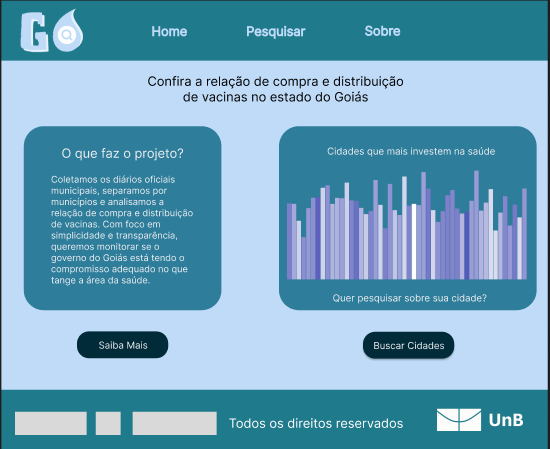
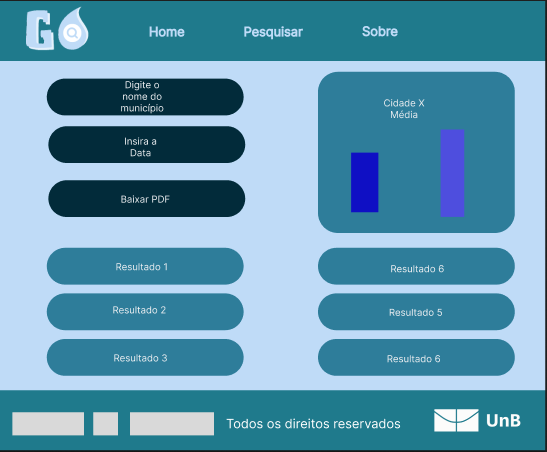
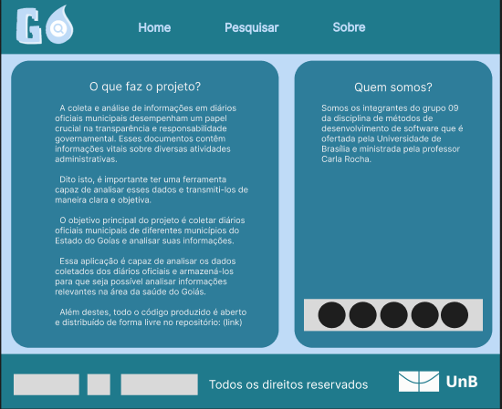

# Protótipo de Alta Fidelidade

## Objetivo

Este protótipo desenvolvido no Figma tem como objetivo principal fornecer uma representação detalhada de todas as funcionalidades do projeto, assim como mostrar a interface do usuário de maneira precisa.

## Visual

### Cores

O desenvolvimento deste protótipo utilizou a seguinte paleta de cores como base:

| Cor               | Hexadecimal                                                |
| :---------------: | :--------------------------------------------------------: |
| Cor 01       |  #BFDBF7 |
| Cor 02       |  #EEF0F2 |
| Cor 03       |  #2E7D9A |
| Cor 04       |  #022B3A |
| Cor 05       |  #FFFFFF |

### Tela 1 - Página Inicial

- A página inicial é o local onde os usuários começam.
- Nela existem duas caixas, uma dá um breve resumo do projeto e a outra mostra os 5 municípios que mais investiram em saúde.
- O botão "Saiba Mais" localizado abaixo das caixas guia o usuário para o [Sobre](#tela-3---sobre).
- O botão "Buscar Cidades" localizado abaixo do gráfico permite ao usuário [pesquisar](#tela-2---página-de-pesquisa) sobre uma cidade especifíca.
- Na parte de cima da Dashboard é possível ver a logo do Gotinha seguida de três botões que servem respectivamente para: retornar a [página inicial](#tela-1---página-inicial), [pesquisar município especifíco](#tela-2---página-de-pesquisa) e [ver mais detalhes sobre o projeto](#tela-3---sobre).

### Tela 2 - Página de Pesquisa

- Esta página permite pesquisar sobre informações contidas no diário oficial de um município especifico, utilizando o nome do município e data desejada.
- Abaixo do campo de pesquisa existe um botão para baixar o diário oficial pesquisado.
- No lado direito da página é possível ver um comparativo entre os investimentos do município desejado e da média dos demais municipíos do Goías.
- Abaixo do gráfico é possível visualizar os resultados das buscas para o período de tempo selecionado.
- Na parte de cima da Dashboard é possível ver a logo do Gotinha seguida de três botões que servem respectivamente para: retornar a [página inicial](#tela-1---página-inicial), [pesquisar município especifíco](#tela-2---página-de-pesquisa) e [ver mais detalhes sobre o projeto](#tela-3---sobre).

### Tela 3 - Sobre

- Esta página permite visualizar detalhes do desenvolvimento do projeto, incluindo um link para o repositório com toda a documentação.
- Na parte de cima da Dashboard é possível ver a logo do Gotinha seguida de três botões que servem respectivamente para: retornar a [página inicial](#tela-1---página-inicial), [pesquisar município especifíco](#tela-2---página-de-pesquisa) e [ver mais detalhes sobre o projeto](#tela-3---sobre).

## Observações

- O protótipo foi desenvolvido utilizando o Figma.
- A Logo do Gotinha foi desenvolvida pelo membro da equipe Márcio utilizando o Canva e o Photoshop.

- As Telas estão sendo desenvolvidas em React e estarão disponíveis em um outro repositório.

## Protótipo

O arquivo feito no figma pode ser visualizado no seguinte [link](https://github.com/unb-mds/2023-2-Squad09/tree/main/Prot%C3%B3tipos/Prot%C3%B3tipo_Alta_Fidelidade).

## Histórico de versão

| Versão | Alteração | Responsável | Data |
| - | - | - | - |
| 1.0 | Criando documento sobre o protótipo de Alta Fidelidade | João Artur Leles | 24/10 |