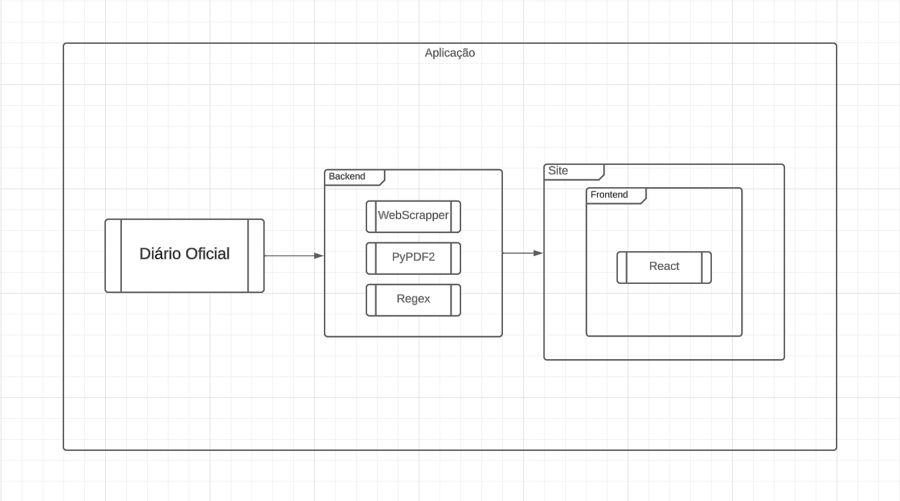

# Documento de Arquitetura

## Sumário

1- [Introdução](#1--introdução)

 * [1.1 - Finalidade](#1.1---Finalidade)

 * [1.2 - Arquitetura de Camadas](#1.2---Arquitetura-de-Camadas)

 * [1.3 - Camada de Apresentção](#1.3---Camada-de-Apresentção)

 * [1.4 - Tecnologias](#1.4---Tecnologias)

## 1- Introdução

### 1.1 - Finalidade Do Documento

Este documento tem como objetivo documentar e organizar a arquitetura do nosso projeto, que visa extrair informações dos Diários Oficiais dos municípios de Goiás. Posteriormente, esses dados serão processados e apresentados em uma interface que permitirá aos usuários realizar pesquisas específicas. Este documento será atualizado constantemente ao longo de todo o processo de desenvolvimento do projeto.

### 1.2 Arquitetura de Camadas 

Quando projetamos uma aplicação em camadas, o objetivo é permitir que essas camadas se comuniquem de maneira eficiente, com o mínimo de interferência entre elas. Isso significa que cada camada pode operar independentemente, o que facilita a manutenção e o desenvolvimento. Além disso, essa abordagem ajuda a manter as responsabilidades bem organizadas, tornando o código mais claro e fácil de gerenciar.

### 1.3 Camada de Apresentação

Este é um esboço inicial que tem como propósito apresentar, por meio deste diagrama, a ideia e o funcionamento do que pretendemos realizar com nossa aplicação.

### 1.4 Tecnologias

**Web Scraping** 

Um web scraper, frequentemente chamado de "raspador web" ou "ferramenta de raspagem", é uma aplicação de software ou script que extrai automaticamente dados de sites na internet. Esse processo de extração de dados envolve o acesso às páginas da web, a análise do HTML delas ou de outros tipos de dados estruturados e, em seguida, a coleta de informações específicas dessas páginas, como texto, imagens, links ou qualquer outro conteúdo relevante.

Os raspadores web são comumente utilizados para diversos fins, incluindo mineração de dados, análise de informações, agregação de conteúdo, rastreamento de preços, indexação em mecanismos de busca e muito mais. Eles podem ser programados para visitar páginas da web e extrair informações desejadas de forma automática, economizando tempo e esforço na coleta de dados na internet.

**PyPDF2** 

O PyPDF2 é uma biblioteca Python usada para trabalhar com arquivos PDF. Ela permite que você crie, leia, modifique e extraia informações de documentos em formato PDF. O PyPDF2 é amplamente utilizado para tarefas como a extração de texto de documentos PDF, a combinação de vários arquivos PDF, a adição de páginas a documentos existentes, a divisão de documentos em várias partes e muito mais.

Além disso, o PyPDF2 fornece funcionalidades para trabalhar com anotações, links e metadados em documentos PDF. É uma biblioteca muito útil para automação de tarefas relacionadas a PDFs e é amplamente utilizada em diversas aplicações, incluindo a extração de dados de relatórios em PDF, a geração de documentos PDF a partir de dados e muito mais.

**Regex** 

Regex, ou expressões regulares, são padrões de texto que descrevem conjuntos de strings. Elas são usadas para buscar, extrair, substituir e manipular texto com base em padrões específicos. As regex são uma poderosa ferramenta para o processamento de texto e são amplamente usadas em programação, processamento de dados e tarefas de busca e substituição de texto.

## Histórico de Versões

| Versão  |  Data  | Autor  |  Descrição  |
| ------------------- | ------------------- | ------------------- | ------------------- |
| 0.1 | 08/10/2023  | Marcio Guilherme | Estrutura inicial  |
