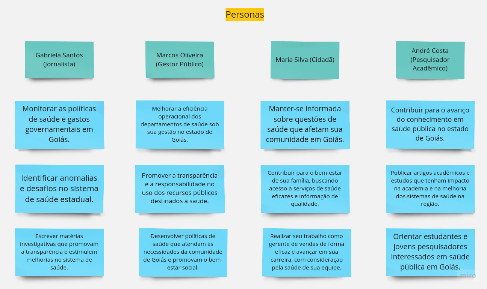

# Personas

**Nome:** Gabriela Santos (Jornalista)

**Idade:** 32 anos

**Gênero:** Feminino

**Formação:** Jornalismo pela UFRJ

**Experiência:** 5 anos de jornalismo, especializada em questões de saúde governamental

**Introdução:** Gabriela é uma jornalista apaixonada pela busca da verdade e pela promoção da transparência no setor de saúde do estado de Goiás. Com 32 anos de idade e uma formação em Jornalismo, ela dedica sua carreira a investigar e monitorar os aspectos relacionados à saúde no governo estadual. Com cinco anos de experiência em jornalismo, ela se especializou em questões de saúde governamental e monitora de perto os gastos e políticas de saúde pública no estado de Goiás. Gabriela acredita que o acesso à informação sobre saúde é fundamental para o bem-estar da população e busca expor questões críticas por meio de seu trabalho.

**Características:**
1. **Comprometimento com a Transparência na Saúde:** Gabriela acredita que a transparência e a responsabilidade são essenciais para o setor de saúde.
2. **Analítica e Detalhista:** Ela é meticulosa em suas investigações, aprofundando-se em dados e estatísticas de saúde.
3. **Conhecimento em Legislação de Saúde:** Possui entendimento sólido das leis e regulamentações relacionadas à saúde pública no estado.
4. **Comunicativa:** Gabriela traduz informações complexas sobre saúde em linguagem acessível para o público.

**Objetivos:**
- Monitorar as políticas de saúde e gastos governamentais em Goiás.
- Identificar anomalias e desafios no sistema de saúde estadual.
- Escrever matérias investigativas que promovam a transparência e estimulem melhorias no sistema de saúde.
- Engajar o público para participar de debates informados sobre questões de saúde governamental.

**Desafios:**
- Restrições de tempo para monitorar o setor de saúde estadual.
- Dificuldade em obter os diários oficiais detalhados sobre os gastos de saúde do governo.
- Enfrentar pressões políticas e orçamentárias que afetam o sistema de saúde.

**Como a aplicação pode ajudar Gabriela?**
- Fornecer acesso a dados detalhados sobre gastos em saúde, políticas e estatísticas.
- Oferecer ferramentas de análise gráfica para facilitar a compreensão e comunicação de informações de saúde.
- Estimular o debate informado sobre questões de saúde, permitindo que Gabriela compartilhe informações com o público.

&nbsp;

**Nome:** Marcos Oliveira (Gestor Público)

**Idade:** 45 anos

**Gênero:** Masculino

**Formação:** Mestrado em Administração Pública

**Experiência:** 20 anos de serviço público, incluindo cargos de gestão em diferentes departamentos governamentais

**Introdução:** Marcos é um gestor público dedicado com vasta experiência em administrar órgãos governamentais relacionados à saúde no estado de Goiás. Com 45 anos de idade e uma formação acadêmica sólida em Administração Pública, ele está comprometido em promover eficiência, transparência e prestação de contas no setor de saúde pública. Sua carreira é marcada pelo foco em melhorar a qualidade dos serviços de saúde e otimizar o uso dos recursos governamentais para beneficiar a população do estado.

**Características:**
1. **Liderança:** Marcos é um líder habilidoso, capaz de motivar e orientar equipes para alcançar metas e objetivos complexos.
2. **Conhecimento Técnico:** Ele possui um profundo conhecimento sobre políticas públicas, regulamentações e procedimentos governamentais.
3. **Visão Estratégica:** Marcos é conhecido por sua visão estratégica, identificando oportunidades de melhoria e inovação na saúde pública.
4. **Tomada de Decisão Baseada em Dados:** Ele valoriza a análise de dados e evidências na tomada de decisões, buscando maximizar a eficácia das políticas públicas.

**Objetivos:**
- Melhorar a eficiência operacional dos departamentos de saúde sob sua gestão no estado de Goiás.
- Promover a transparência e a responsabilidade no uso dos recursos públicos destinados à saúde.
- Desenvolver políticas de saúde que atendam às necessidades da comunidade de Goiás e promovam o bem-estar social.
- Colaborar com outras instâncias do governo e a sociedade civil para alcançar objetivos comuns na área de saúde pública.

**Desafios:**
- Pressões políticas e orçamentárias para equilibrar as demandas da comunidade com os recursos limitados.
- Garantir a implementação eficaz de políticas públicas em face de burocracia e resistência interna.
- Manter um alto padrão ético e garantir que o governo atenda às expectativas do público.

**Tecnologia e Ferramentas:** Marcos faz uso dos sistemas de gerenciamento governamental e ferramentas de análise de dados para avaliar o desempenho dos departamentos sob sua supervisão, como por exemplo, os diversos sites governamentais que hospedam os diários oficiais.

**Como a aplicação pode ajudar Marcos Oliveira?**
- Fornecer acesso a todos os diários oficiais relacionados a saúde pública do Goiás, incluindo estatísticas, orçamentos e políticas.
- Facilitar a comunicação e a colaboração entre os departamentos de saúde e outras instâncias do governo no estado.
- Melhorar a transparência e a acessibilidade dos dados de saúde para a comunidade em Goiás, promovendo uma saúde pública mais eficaz e informada.

&nbsp;

**Nome:** Maria Silva (Cidadã)

**Idade:** 30 anos

**Gênero:** Feminino

**Formação:** Graduada em Administração

**Profissão:** Gerente de Vendas

**Introdução:** Maria Silva é uma cidadã comum de 30 anos de idade, que trabalha como gerente de vendas em uma empresa de médio porte em Águas Lindas-GO. Ela tem uma formação em Administração e vive uma vida típica, equilibrando seu trabalho, família e interesses pessoais. Maria está interessada em manter-se informada sobre questões que afetam sua comunidade, com um foco especial na área de saúde do estado de Goiás, embora não tenha uma participação política ou cívica muito ativa.

**Características:**
1. **Vida Atarefada:** Maria tem uma rotina ocupada, equilibrando seu trabalho e responsabilidades familiares.
2. **Interesse na Saúde de Goiás:** Ela demonstra um interesse específico na área de saúde do estado de Goiás e em questões de qualidade dos serviços de saúde.
3. **Consumidora de Notícias:** Ela se mantém informada sobre eventos atuais relacionados à saúde pública e questões de bem-estar por meio de notícias na televisão e nas redes sociais.
4. **Preocupação com Qualidade de Vida:** Maria valoriza a qualidade de vida de sua família e da comunidade de Goiás, com ênfase na disponibilidade de serviços de saúde de qualidade.

**Objetivos:**
- Manter-se informada sobre questões de saúde que afetam sua comunidade em Goiás.
- Contribuir para o bem-estar de sua família, buscando acesso a serviços de saúde eficazes e informação de qualidade.
- Realizar seu trabalho como gerente de vendas de forma eficaz e avançar em sua carreira, com consideração pela saúde de sua equipe.

**Desafios:**
- Tempo Limitado: Maria enfrenta restrições de tempo devido à sua rotina agitada, mas busca recursos de saúde eficazes para sua família.
- Compreensão de Assuntos Complexos: Algumas questões de saúde pública podem parecer complexas, e Maria busca informações de fácil compreensão.
- Equilíbrio entre Vida Pessoal e Profissional: Ela procura equilibrar suas responsabilidades familiares e seu trabalho, levando em conta a saúde de sua equipe.

**Como a aplicação pode ajudar Maria Silva?**
- Fornecer informações de saúde pública de fácil compreensão, permitindo que Maria se mantenha informada sobre questões de saúde em Goiás.
- Facilitar o acesso a recursos e informações sobre serviços de saúde disponíveis em Goiás, incluindo opções de qualidade para sua família e equipe.

&nbsp;

**Nome:** André Costa (Pesquisador Acadêmico)

**Idade:** 38 anos

**Gênero:** Masculino

**Formação:** Doutorado em Ciências Sociais com foco em Saúde Pública

**Profissão:** Pesquisador Acadêmico

**Introdução:** André Costa é um pesquisador acadêmico de 38 anos com formação em Ciências Sociais e um doutorado em Saúde Pública em andamento, com foco específico na área de saúde do estado de Goiás. Sua vida gira em torno da pesquisa e do estudo aprofundado das questões de saúde pública na região. Ele dedica a maior parte de seu tempo à análise de dados, leitura de literatura acadêmica e condução de pesquisas de campo. A busca por compreensão e conhecimento no contexto da saúde é o que motiva sua carreira acadêmica.

**Características:**
1. **Compromisso com a Pesquisa em Saúde:** André é apaixonado pela pesquisa acadêmica em saúde pública e dedica longas horas a estudos e investigações na área.
2. **Mente Analítica em Saúde:** Ele possui uma mente analítica aguçada e habilidades avançadas de análise de dados específicos da saúde.
3. **Conhecimento Profundo em Saúde Pública:** André tem conhecimento profundo sobre políticas de saúde, sistemas de saúde e desafios específicos relacionados à saúde em Goiás.
4. **Comunicador Habilidoso em Saúde:** Ele é capaz de comunicar suas descobertas e análises de forma clara e eficaz, seja em artigos acadêmicos, apresentações ou discussões com a comunidade de saúde de Goiás.

**Objetivos:**
- Contribuir para o avanço do conhecimento em saúde pública no estado de Goiás.
- Publicar artigos acadêmicos e estudos que tenham impacto na academia e na melhoria dos sistemas de saúde na região.
- Participar de conferências acadêmicas e eventos de saúde em Goiás para compartilhar suas descobertas e se manter atualizado com as necessidades de saúde da comunidade.
- Orientar estudantes e jovens pesquisadores interessados em saúde pública em Goiás.

**Desafios:**
- Manter-se atualizado com a constante evolução das políticas e práticas de saúde em Goiás.
- Garantir financiamento para suas pesquisas em saúde e projetos relacionados à saúde pública na região.
- Gerenciar a pressão e expectativas associadas à publicação de trabalhos acadêmicos de alta qualidade que contribuam para o bem-estar da comunidade de saúde de Goiás.

**Como a aplicação pode ajudar André Costa?**
- Fornecer acesso a bases de dados específicos de saúde pública em Goiás, incluindo informações sobre políticas de saúde, estatísticas e desafios.
- Auxiliar na análise de dados de saúde e na criação de visualizações para suas pesquisas em saúde pública.
- Facilitar a colaboração com outros pesquisadores e instituições de saúde em Goiás, identificando oportunidades de financiamento e pesquisa conjunta.

