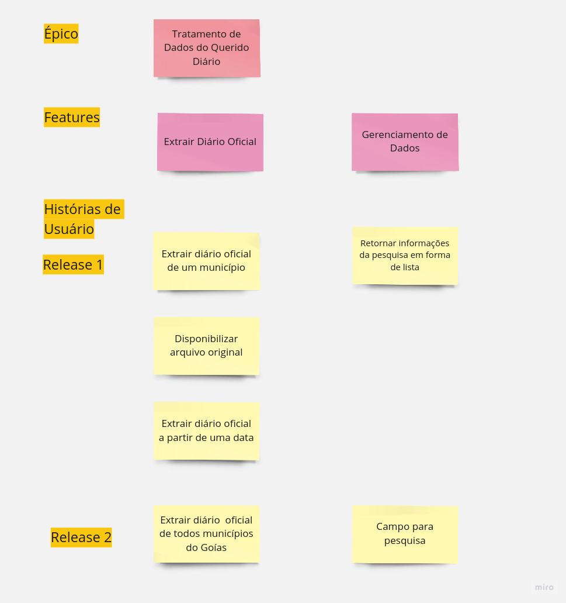

# Story Map

Um  Story Map é uma ferramenta visual que ajuda a criar uma representação estruturada de funcionalidades de um sistema ou produto. Ele é composto por histórias de usuário organizadas em um fluxo lógico, permitindo uma melhor compreensão das necessidades dos usuários e como elas se relacionam.

## Divisão

O Story Map possui um Épico relacionado ao tratamento dos dados, que se divide em duas features(Extração e Filtro), e suas respectivas histórias de usuário.