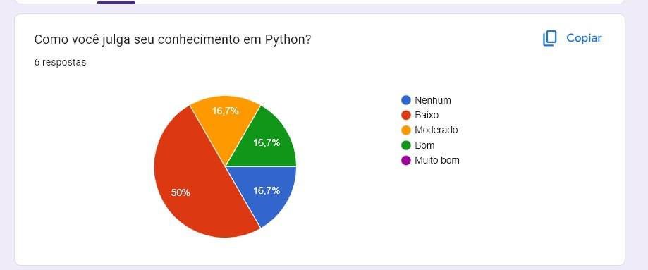
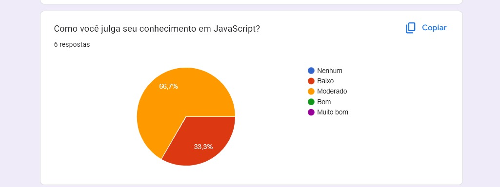
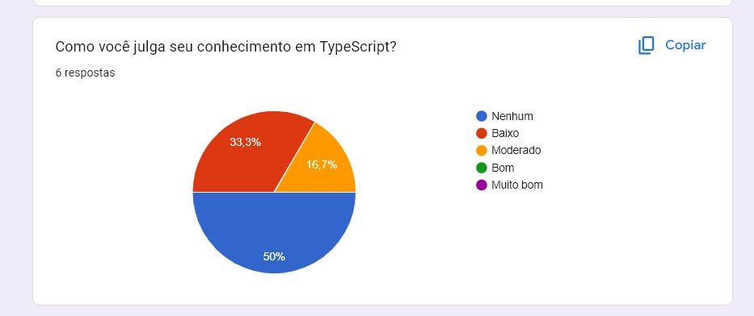
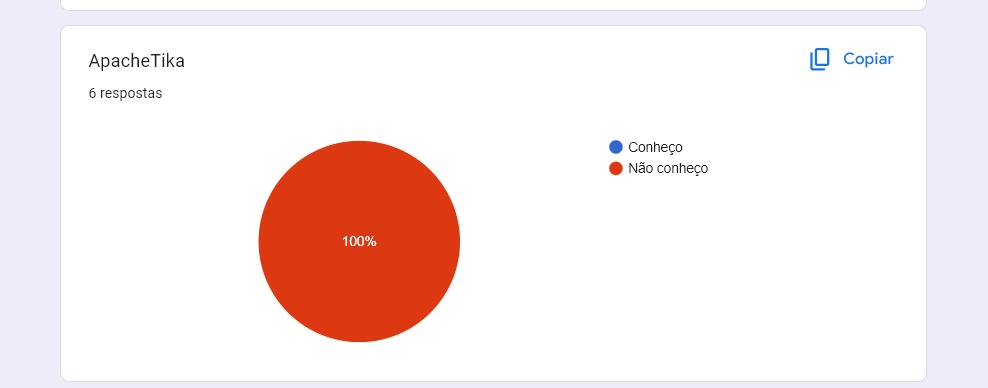
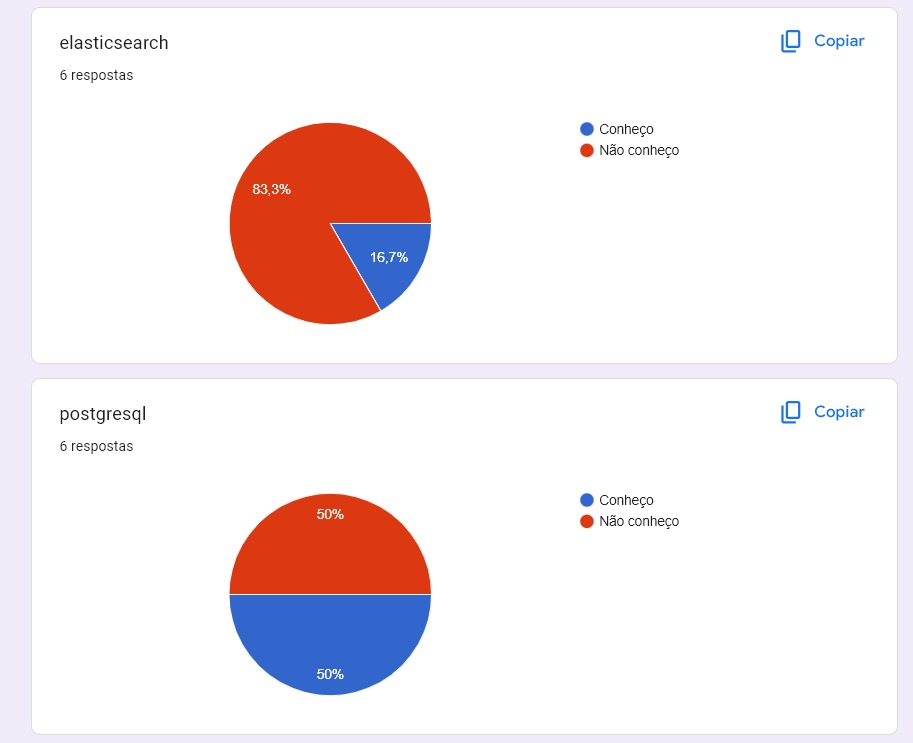
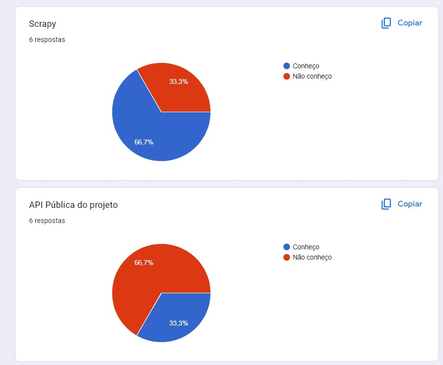
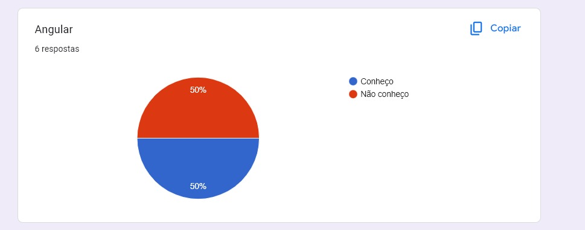

#  Mapeamento de tecnologias

- Segundo a pesquisa feita pelo Paulo Henrique, a melhor linguagem pra ser utilizada é JavaScript, ou Python caso não de pra usar Java Script.
- Entre as API's, Frameworks e bibliotecas citados Scrapy, PostgreSQL e Angular são os mais conhecidos e tendo uma possibilidade maior de uso.

## Conhecimentos sobre as seguintes linguagens:

### Python 

- Uma das melhores opçoẽs a ser considerada, Por também ser utilizado no [Querido Diário](https://queridodiario.ok.org.br/).
- Como mostra nesse gráfico 50% da equipe possui baixo conhecimento sobre python.

### JavaScript

- Uma das melhores opçoẽs a ser considerada. Com 66,7% do grupo possuindo conhecimento moderado sobre JavaScript e 33,3% conhecimento baixo.

### TypeScript

- Uma opção não recomendada pelo fato de 50% do grupo não possuir conhecimento sobre o uso de TypeScript.

## Conhecimentos acerca das API's e Frameworks utilizados:

### ApacheTika

- Ninguem do grupo possui conhecimento sobre ApacheTika.

### ElasticSearch e PostgreSQL

- Ninguem do grupo possui conhecimento sobre ElasticSearch.
- 50% do  grupo tem conhecimento sobre PostgreSQL.

### Scrapy e API Pública

- 66,7% do grupo possui conhecimento sobre Scrapy.
- 66,7% do grupo não possui conhecimento sobre a API.

### Angular

- Metade do grupo possui conhecimento sobre Angular.

