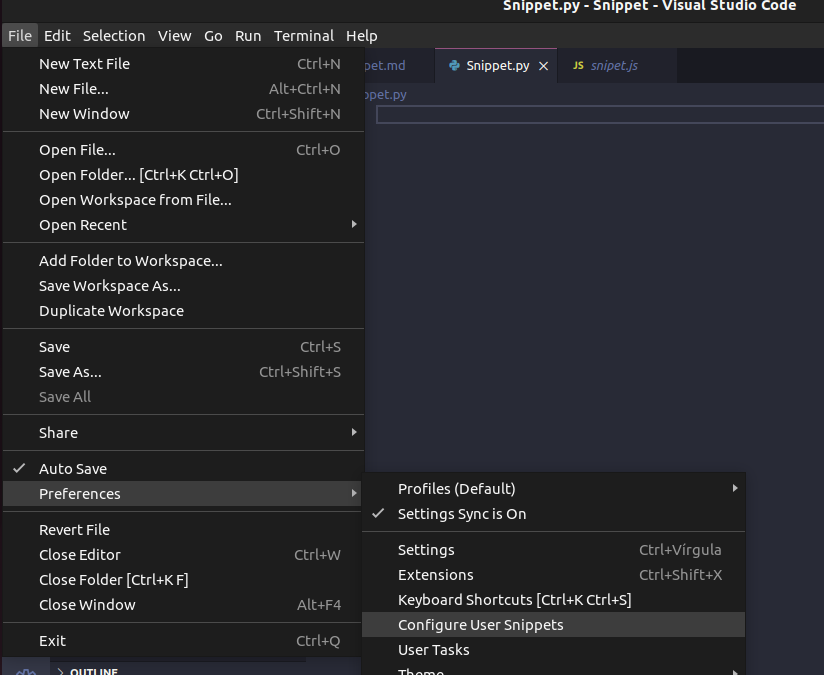
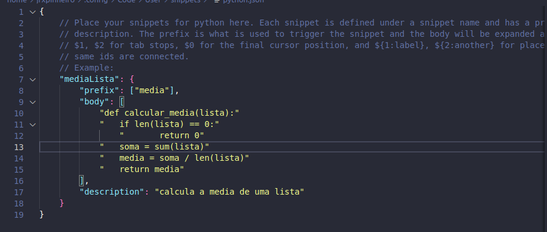
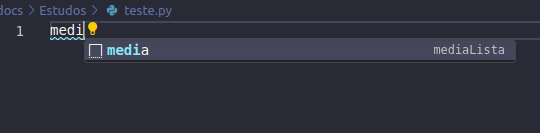
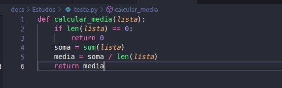

# Snippet

## 1. Introdução

Snippet é um pequeno trecho ou fragmento de código fonte. Esses trechos de código são frequentemente usados para realizar tarefas específicas e podem ser reutilizados em diferentes partes de um programa ou em projetos diferentes. Snippets são especialmente úteis para economizar tempo, evitar erros de digitação e seguir as melhores práticas de programação.

Por exemplo, se um programador frequentemente precisa ordenar uma lista de números, ele pode criar um snippet que contenha o código de ordenação. Em vez de reescrever esse código toda vez que for necessário, o programador pode simplesmente inserir o snippet em seu código sempre que precisar realizar essa tarefa específica.

## 2. Exemplo de Snippet

Aqui está um exemplo de código Python que pode ser considerado como snippet:

- Formato de snippet:

~~~python
	"mediaLista": {
		"prefix": ["media"],
		"body": [
			"def calcular_media(lista):"
			"	if len(lista) == 0:"
				"		return 0"
			"	soma = sum(lista)"
			"	media = soma / len(lista)"
			"	return media"
		],
		"description": "calcula a media de uma lista"
	}
~~~

- Formato de código Python:

~~~python
def calcular_media(lista):
    if len(lista) == 0:
        return 0
    soma = sum(lista)
    media = soma / len(lista)
    return media
~~~

## 3. Snippet no VScode

Neste exemplo o Snippet mostrado anteriormente será implementado no VScode.

Ao selecionar o botão "configure user snippets", uma pequena tela será aberta mostrando uma lista de linguagens que pode ser selecionadas, conforme mostram as imagens:

<table>
  <tr>
    <td></td>
    <td></td>
  </tr>
</table>

Ao selecionar a linguagem(Python neste exemplo), uma nova tela será aberta, nesta tela é possível escrever o código do snippet.

Após isso é possível chamar o snippet em qualquer código no VScode.

<table>
  <tr>
    <td></td>
    <td></td>
  </tr>
</table>

## 4. Conclusão

Snippets desempenham um papel fundamental na eficiência e produtividade dos desenvolvedores.Eles oferecem uma maneira rápida e conveniente de reutilizar código, compartilhar soluções, aprender com exemplos.

Ao encapsular trechos de código em snippets é possível economizar tempo e esforço evitando a digitação repetitiva de código comum. Eles também promovem boas práticas de codificação, facilitando a padronização e a documentação de códigos úteis. Sendo assim uma parte essencial no desenvolvimento de um projeto.

## 5. Links úteis

- [O que são snippets](http://www.linhadecodigo.com.br/artigo/1940/snippets-o-que-sao-como-e-quando-utiliza-los.aspx)

- [Criando snippets](https://www.youtube.com/watch?v=I2G_JqPclgA)

- [Tutorial sobre snippets no Python](https://www.youtube.com/watch?v=4RS4f737c5Y)

- [Snippets no VScode](https://code.visualstudio.com/docs/editor/userdefinedsnippets)

## 6. Histórico de versão

| Versão | Alteração | Responsável | Revisor | Data |
| - | - | - | - | - |
| 1.0 | Criando documento sobre Snippet | João Artur Leles | - | 20/09 |